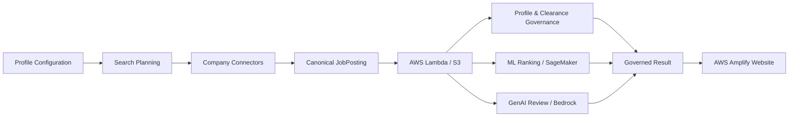

# AWS AI Job Search Agent

An AWS-based AI job-search platform that collects opportunities from multiple employers, normalizes job data, applies profile-specific eligibility and clearance governance, ranks opportunities with machine learning, and supports evidence-grounded GenAI review.

## Live Demo

https://main.d1lez6edks2xou.amplifyapp.com/

## What the Platform Does

**Status:** DEPLOYED — Phase 1 Complete (2026-09-29) 

**Discover -> Govern -> Rank -> Review**

- Collects public job opportunities through company-specific connectors.
- Normalizes heterogeneous postings into a canonical job-data contract.
- Isolates search policies and job families by user profile.
- Applies clearance-aware eligibility rules for government-contractor opportunities.
- Uses Amazon SageMaker for ML-based ranking signals.
- Uses Amazon Bedrock for evidence-grounded GenAI review.
- Preserves governance decisions, evidence limitations, and provenance through downstream results.
- Publishes recruiter-friendly results through AWS Amplify.

## Architecture

- Multi-company connector architecture
- Canonical JobPosting schema
- Configuration-driven search terms
- Profile-isolated search policies
- Clearance normalization and eligibility governance
- AWS Lambda serverless execution
- Amazon S3 evidence persistence
- SageMaker ML ranking
- Bedrock grounded review
- End-to-end result contract validation
- AWS Amplify portfolio deployment

## Public Source Modules

The repository contains a curated subset of the project source code intended to demonstrate the core architecture without publishing development artifacts, credentials, private configuration, or the complete production environment.

A validated government-contractor workflow preserves the original job evidence, normalizes clearance requirements, applies profile eligibility policy, retains the SageMaker ranking signal, and carries the Bedrock review status and evidence limitations into the canonical downstream result.

ML ranking scores in this project are demonstration signals and should not be interpreted as calibrated probabilities of receiving a job offer.

## Daily Search

The web interface is designed to present a rolling history of up to seven successful daily search snapshots. Job availability and requirements should always be confirmed on the employer's official career site.

## Technology

Python | AWS Lambda | Amazon S3 | Amazon SageMaker | Amazon Bedrock | AWS Amplify

## Repository Structure

'''
Profile Configuration
        |
        v
Search Planner
        |
        v
Company Connectors
        |
        v
Canonical JobPosting
        |
        v
Profile / Clearance Governance
        |
        v
AWS Lambda + Amazon S3
        |
        v
Amazon SageMaker
        |
        v
Amazon Bedrock
        |
        v
Governed Result
        |
        v
AWS Amplify Website
'''

Portfolio proof of concept and engineering demonstration.

## Author

Jingru Chen

## Disclaimer

This is an independent portfolio project. Employer names and public job postings are used only to demonstrate job-search and AI engineering workflows. This project is not affiliated with or endorsed by the employers represented in the demo.
