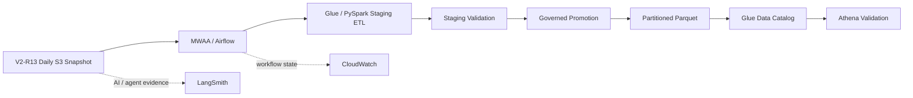
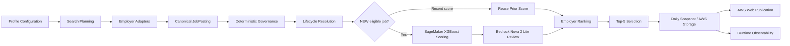

# AWS AI Job Search Agent

### Production-Oriented AWS AI Platform for Profile-Isolated Job Discovery, Governance, ML Ranking, GenAI Review & Governed Analytics

**Employer Adapters | Deterministic Governance | AWS Lambda | Amazon SageMaker | XGBoost | Amazon Bedrock | Nova 2 Lite | Amazon S3 | AWS Glue / PySpark | Parquet | Athena | Amazon MWAA / Airflow | CloudWatch | LangSmith**

> A production-oriented AWS AI portfolio project that discovers jobs from heterogeneous employer sources, applies deterministic governance, ranks eligible opportunities with profile-specific XGBoost models, performs grounded GenAI review with Amazon Nova 2 Lite, publishes daily profile-isolated results, and extends the operational platform with governed analytics, workflow orchestration, and layered observability.

---

## Live Project

**Current Release:** V2 / Phase 2 — Production Data, Orchestration & Observability  
**Status:** VALIDATED / PORTFOLIO-READY — Phase 2 Complete (2026-10-04)  

🌐 **AWS Website:** [Open Live AWS Job Search Agent](https://main.d1lez6edks2xou.amplifyapp.com/)

📊 **V2 Presentation:** [View AWS AI Job Search Agent V2 PPT](./AWS_AI_Job_Search_Agent_V2_ROADMAP_20261004.pptx)

📄 **V1 Baseline Presentation:** [View AWS AI Job Search Agent V1 PDF](./AWS_AI_Job_Search_Agent_V1_ROADMAP_20260929.pdf)

> **Production boundary:** EventBridge remains the unattended daily scheduler for the core V2-R13 job-search runtime. Amazon MWAA was added as a controlled orchestration layer for the multi-step analytics workflow; it does not replace the production daily scheduler.

## V2 / Phase 2 — Production Data, Orchestration & Observability

V2 extends the validated V1 job-search platform without rewriting the frozen core runtime.

### What V2 Adds

- **AWS Glue / PySpark analytics ETL** over profile-isolated daily S3 snapshots.
- **Analytics-ready Parquet** output published through the **AWS Glue Data Catalog** and validated with **Amazon Athena**.
- **Amazon MWAA / Apache Airflow** orchestration with explicit task dependencies, retry/failure handling, run-scoped staging, governed promotion, and final validation.
- **Controlled end-to-end validation:** **8/8 Airflow tasks passed**.
- **CloudWatch runtime evidence:** the successful controlled workflow emitted **`MWAA_E2E_PASS`**.
- **Layered observability:** Airflow for workflow state and dependencies, CloudWatch for AWS runtime evidence, and LangSmith for AI/agent execution tracing.
- **Evidence-based release freeze:** V2-R13, Glue Analytics V1, and MWAA V1 were frozen only after controlled validation and hash verification.

### V1 → V2 Evolution

| Phase | Primary Scope | Validated Outcome |
|---|---|---|
| **V1 / Phase 1** | Core AI job-search platform | Employer adapters → deterministic governance → profile-specific XGBoost → Bedrock Nova 2 Lite → profile-isolated publication |
| **V2 / Phase 2** | Production data & workflow engineering | Glue/PySpark → Parquet/Data Catalog/Athena → MWAA/Airflow → CloudWatch + LangSmith observability |

### V2 Controlled Analytics Workflow



**Validated orchestration contract:**  
`validate_runtime_config → verify_v2_r13 → verify_source_snapshot → start_glue_staging → wait_glue_staging → validate_staging → governed_promotion → validate_final`

The successful controlled MWAA run completed all eight tasks and preserved the frozen V2-R13 and Glue promotion boundaries.

---

## Project at a Glance

| Capability | Implementation |
|---|---|
| Job Discovery | Employer-specific adapters behind a shared platform |
| Candidate Profiles | Profile-isolated configuration, scoring, results, and history |
| Deterministic Governance | Job-family, internship, clearance, and eligibility policies |
| ML Ranking | Profile-specific XGBoost models on Amazon SageMaker |
| GenAI Review | Amazon Nova 2 Lite through Amazon Bedrock |
| Lifecycle Management | NEW / recent-score / inactive job resolution |
| Publication | Daily AWS-hosted, profile-isolated results |
| Analytics Engineering | AWS Glue / PySpark → partitioned Parquet → Glue Data Catalog → Athena validation |
| Workflow Orchestration | Amazon MWAA / Airflow with dependencies, retries, staging, governed promotion, and final validation |
| Observability | Airflow workflow state + CloudWatch runtime evidence + LangSmith AI/agent tracing |

### Validated Daily Run

**3,154 raw jobs searched → 191 NEW eligible jobs AI-scored → 20 published recommendations**

The platform currently supports two isolated candidate profiles:

- **Frank** — Data Science, AI/ML, quantitative, and related roles
- **Family-A** — Bioanalysis, LC-MS/MS, and related scientific roles

Both profiles share the same platform architecture while maintaining separate business search logic, eligibility policies, scoring paths, results, and history.

---

## Why I Built This

A realistic job-search platform is not simply a search script or an LLM prompt.

Different employers expose different search backends and schemas. Different candidates require different job families and eligibility rules. Government-contractor postings introduce clearance constraints. Previously scored jobs should not be unnecessarily rescored. AI ranking must remain governed and explainable.

The platform therefore separates:

**Employer integration → canonical normalization → deterministic governance → lifecycle resolution → ML ranking → GenAI review → publication → observability**

This keeps employer-specific implementation details behind adapters while preserving one shared platform.

---

## End-to-End Architecture



### Runtime Flow

**Discover → Normalize → Govern → Resolve → Score → Review → Rank → Publish → Observe**

---

## Key Engineering Decisions

### 1. Adapter-Based Employer Integration

Employer-specific backend behavior is isolated behind adapters/connectors.

Adding or changing an employer should not require rewriting the downstream governance, scoring, publication, or observability layers.

---

### 2. Profile-Isolated Configuration

Candidate profiles share infrastructure and code, but not business-search logic.

Each profile can independently define:

- target job families;
- search terms;
- employer coverage;
- deterministic eligibility rules;
- clearance policies;
- ML scoring path;
- daily results;
- scoring history.

This prevents cross-profile job leakage.

---

### 3. Deterministic Governance Before AI

Known business rules are handled deterministically before probabilistic ML or GenAI.

Examples include:

- exclude internships;
- exclude clearly irrelevant job families;
- enforce profile-specific role boundaries;
- normalize clearance requirements;
- exclude disallowed high-security-clearance positions;
- remove other deterministic policy violations.

This reduces unnecessary AI calls and keeps hard business rules auditable.

---

### 4. Incremental AI Scoring

The system distinguishes NEW jobs from recently scored postings.

NEW eligible jobs receive fresh AI scoring, while recently scored jobs may reuse cached results according to the lifecycle policy.

The important ranking contract is:

> **Score every NEW eligible posting first → rank eligible jobs → retain up to the Top 5 NEW jobs per employer.**

This avoids selecting candidates before the full eligible NEW population has been scored.

---

### 5. Separate ML Ranking and GenAI Review

The platform intentionally gives conventional ML and GenAI different responsibilities.

> **Rules govern → XGBoost ranks → Nova reviews/explains**

Amazon SageMaker XGBoost provides the quantitative job-fit ranking signal.

Amazon Bedrock Nova 2 Lite provides evidence-grounded semantic review.

The GenAI layer does **not** overwrite the SageMaker score.

---

### 6. Artifact-Driven Observability

Runtime observability consumes persisted execution evidence rather than redefining application truth.

This separates:

**application execution**

from

**observability and presentation**

and makes debugging, validation, and future governance metrics easier to scale.

---

# ML + GenAI Design

## Amazon SageMaker — Profile-Specific XGBoost

The current implementation uses separate XGBoost model paths for the two candidate profiles.

### Frank Model

The Frank model demonstrates the complete ML lifecycle:

**Human-Labeled Ground Truth → Structured Features → XGBoost Training → SageMaker Model → Inference → Job-Fit Ranking**

A validated SageMaker run produced a demonstration score of approximately:

**0.8923**

for a GDIT test case.

This is treated as a **small-sample demonstration ranking score, not a calibrated probability of job success**.

The purpose of V1 is to validate the ML architecture and end-to-end scoring lifecycle. The architecture allows the ground-truth dataset and evaluation framework to grow without redesigning the application.

---

## Family-A Model

Family-A uses a separate model/data path for scientific roles such as:

- LC-MS/MS;
- bioanalysis;
- senior/principal scientist;
- scientific management roles.

This provides a practical test of profile isolation: the two candidate profiles use the same platform but different search domains and ML ranking contexts.

---

## Amazon Bedrock — Nova 2 Lite

Amazon Nova 2 Lite provides the GenAI semantic-review layer through Amazon Bedrock.

Its role is different from XGBoost.

### XGBoost

Answers:

> **How strongly does this job fit the candidate profile quantitatively?**

### Nova 2 Lite

Supports questions such as:

> **Why does the job appear relevant?**

> **What job evidence supports the match?**

> **What uncertainty or review concern remains?**

The Bedrock review layer does not replace deterministic governance and does not mutate the SageMaker ranking score.

---

# Daily Governed Workflow

## 1. Discover

Employer-specific connectors collect public job postings.

Different employer backends remain isolated behind adapters.

---

## 2. Normalize

Raw employer records are transformed into a canonical job representation.

This prevents downstream scoring and governance code from becoming employer-specific.

---

## 3. Govern

Deterministic rules are applied before AI scoring.

The governance layer handles known constraints such as:

- internship exclusion;
- job-family eligibility;
- profile isolation;
- clearance classification;
- deterministic policy exclusions.

---

## 4. Resolve Lifecycle

Jobs are classified according to their lifecycle state.

Examples include:

- NEW eligible posting;
- recently scored posting;
- inactive/disappeared posting.

This supports incremental daily processing rather than unnecessary full rescoring.

---

## 5. Score

Every NEW eligible posting is scored before Top-N selection.

Profile-specific XGBoost scoring is executed through Amazon SageMaker.

---

## 6. Review

Amazon Bedrock Nova 2 Lite provides grounded semantic review while preserving the original ML ranking signal.

---

## 7. Rank & Publish

Eligible jobs are ranked by employer.

The system retains up to the:

**Top 5 NEW jobs per employer per day**

and publishes profile-isolated daily results.

---

## 8. Observe

Execution evidence is preserved for:

- debugging;
- runtime validation;
- observability;
- governance analysis;
- future regression testing.

---

# Profile Isolation

One of the core architectural requirements is:

> **Profiles share infrastructure — not business search results.**

### Frank

Target domain:

**Data Science / AI / ML / Quantitative roles**

### Family-A

Target domain:

**Bioanalysis / LC-MS/MS / Scientific roles**

The architecture keeps the following profile-aware:

**Search configuration → governance → scoring → results → history**

This makes additional future candidate profiles an extension of the platform rather than a platform rewrite.

---

# Government-Contractor Governance

Government-services and contractor jobs require additional eligibility logic.

Clearance requirements are normalized before AI ranking.

The platform can permit configured low-level categories such as:

- no clearance requirement;
- Public Trust;
- other explicitly allowed categories.

Higher-security-clearance roles can be deterministically excluded before ML scoring.

This illustrates a broader design principle:

> **Known policy constraints belong in deterministic governance, not inside an opaque ML score.**

---

# AWS Runtime Evidence

The project has been executed using real AWS resources rather than only local simulations.

## Amazon SageMaker

Validated AWS Console evidence includes:

- profile-specific SageMaker model resources;
- completed XGBoost training jobs;
- SageMaker XGBoost training container;
- persisted model artifacts;
- SageMaker inference/scoring workflow.

Example training environment:

**SageMaker XGBoost 1.7-1**

---

## Amazon Bedrock

Amazon Bedrock provides access to:

**Amazon Nova 2 Lite**

for the semantic-review layer.

The project keeps Bedrock review logically separate from the quantitative SageMaker ranking signal.

---

## AWS Application Runtime

The platform also uses AWS runtime/storage/publication components for job collection, persisted artifacts, and web delivery.

The repository intentionally separates application code from credentials and account secrets.

---

# Results

A validated Frank daily run produced:

| Stage | Count |
|---|---:|
| Raw jobs searched | **3,154** |
| NEW eligible jobs AI-scored | **191** |
| Published recommendations | **20** |

The result demonstrates the intended funnel:

**Large raw employer population**

↓

**Deterministic eligibility governance**

↓

**AI scoring of eligible NEW postings**

↓

**Employer-level ranking**

↓

**Small recruiter/candidate-facing recommendation set**

The objective is not to maximize the number of jobs displayed. It is to reduce a large search population into a governed, explainable, profile-specific shortlist.

---

# Runtime Observability

V2 uses layered observability rather than treating monitoring as a single tool:

- **Amazon MWAA / Airflow** — workflow state, task dependencies, retries, and execution history.
- **Amazon CloudWatch** — AWS runtime logs and controlled E2E evidence, including `MWAA_E2E_PASS`.
- **LangSmith** — application-level AI/agent tracing across the governed job-search workflow.

LangSmith provides presentation-quality application tracing across the governed workflow.

The validated trace hierarchy includes stages such as:

1. Profile Configuration
2. Search Planning
3. Company Collection
4. Canonical Normalization
5. Governance
6. Lifecycle Resolution
7. AI Ranking
8. Daily Snapshot
9. AWS Publication
10. Website Publication

This makes the system easier to inspect as a workflow rather than treating the entire daily run as a single opaque model call.

---

# Repository Structure

```text
aws-ai-job-search-agent/
│
├── README.md
├── .gitignore
│
├── src/
│   └── application and pipeline source code
│
├── web/
│   └── recruiter-facing website assets
│
└── docs/
    ├── presentation/
    │   └── final portfolio presentation
    │
    ├── evidence/
    │   ├── SageMaker execution evidence
    │   ├── Bedrock evidence
    │   ├── website evidence
    │   └── LangSmith observability evidence
    │
    └── architecture/
        └── architecture diagrams
```

The portfolio cleanup intentionally avoids reorganizing working source-code paths simply for presentation purposes.

The goal is:

> **Improve documentation structure without introducing unnecessary application risk.**

---

# Phase 1 / V1 — Frozen Core Platform Baseline

### Implemented / Validated

- Shared multi-profile platform
- Employer adapter boundary
- Canonical job normalization
- Deterministic governance
- Profile isolation
- Clearance normalization
- NEW/recent lifecycle handling
- Incremental score reuse
- Profile-specific XGBoost scoring
- Amazon SageMaker execution
- Amazon Bedrock Nova 2 Lite review
- Employer-level Top-5 ranking
- Daily profile-isolated publication
- Seven-day history design
- LangSmith application tracing
- AWS execution evidence

V1 remains the frozen core-platform baseline underneath the additive V2 production-engineering layer.

---

# Engineering Roadmap

V1 and V2 are validated baselines. Future work starts beyond the completed Phase 2 production-engineering layer.

## V3 — Agentic Workflow

Potential extensions:

- specialized search/retrieval agents;
- governance/review agents;
- dynamic workflow routing;
- cross-employer orchestration;
- state-aware execution;
- human escalation paths.

The goal is not to add agents for their own sake, but to introduce agentic behavior where specialized decision-making provides measurable value.

---

## V4 — Harness Engineering

Longer-term production engineering focuses on the control layer surrounding agent execution:

- agent runtime / control plane;
- state and context management;
- tool and model routing;
- policy and guardrail enforcement;
- retry, recovery, and escalation;
- evaluation and regression quality gates;
- trace, latency, and cost telemetry;
- human-in-the-loop controls.

The target is:

> **Reliable, governed AI/agent execution at scale.**

---

# Engineering Principles

This project follows several principles that generalize beyond job search:

> **Diagnose broadly, change narrowly, validate end-to-end, freeze proven layers.**

> **Deterministic rules govern known constraints; ML ranks uncertainty; GenAI explains semantic evidence.**

> **Share platform infrastructure without leaking profile-specific business logic.**

> **Observability should report runtime truth, not redefine it.**

> **Production architecture should make future extension additive rather than requiring repeated rewrites.**

---

# Portfolio Materials

The repository includes:

- source code for the AWS AI Job Search Agent;
- recruiter-facing web assets;
- architecture and implementation documentation;
- AWS runtime evidence;
- LangSmith observability evidence;

See:

**`docs/presentation/`**

for the final project presentation.

---

## Project Status

**Status: V2 / PHASE 2 VALIDATED / PORTFOLIO-READY**

V1 is retained as the frozen core-platform baseline. V2 adds the validated production data, orchestration, and observability layer. Future work begins with V3+ extensions rather than treating V2 as unfinished.


 
